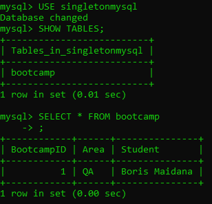
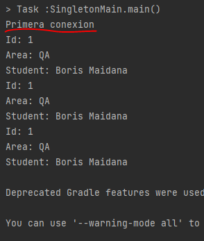

# bootcamp-patterns SINGLETON
CHALLENGE BOOTCAMP MOJIX: Add a singletone architecture for MySql database

Database used for this challenge:\n

Result of executing 3 times the database connection (it only connects once):\n

Sources: 
[Github](https://gist.github.com/jasoet/3843797)
[MySQL Doc](https://dev.mysql.com/doc/connector-j/8.0/en/connector-j-usagenotes-connect-drivermanager.html#connector-j-examples-connection-drivermanager)
